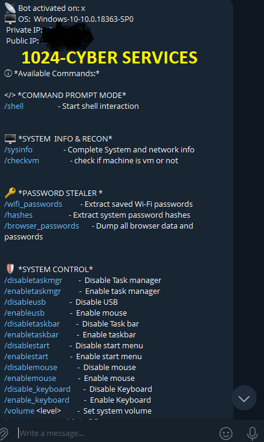
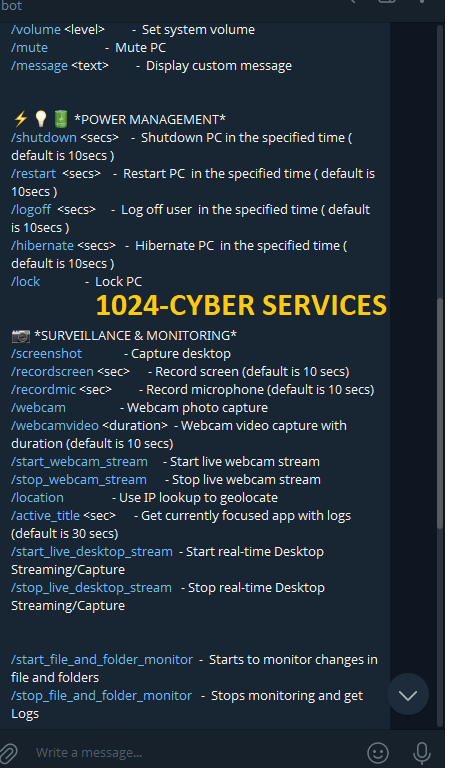
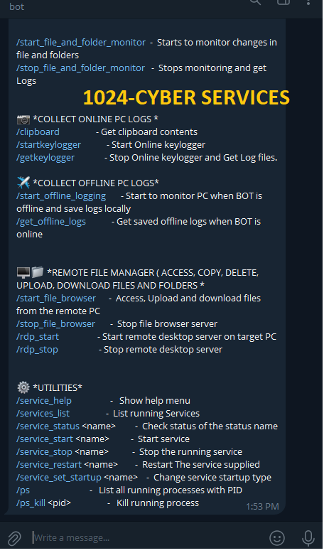
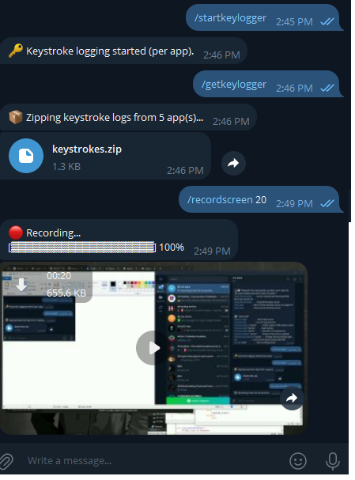
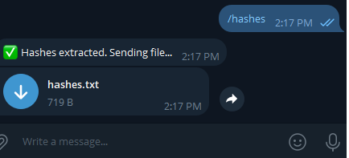
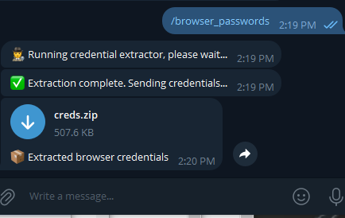
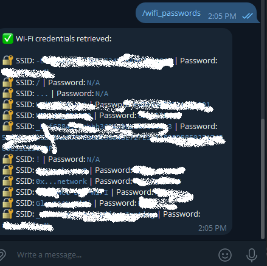
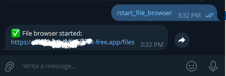
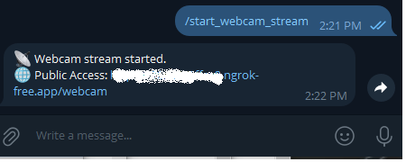
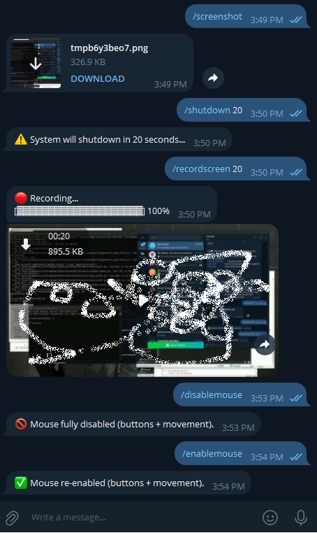

 🕵️‍♂️ Windows-C2 Bot  

🎯 Your All-in-One Telegram-Controlled Windows Surveillance & Remote Admin Tool

Windows-C2-Bot is a lightweight but powerful Python-based Command-and-Control (C2) framework designed to manage and monitor,  Windows systems entirely through a Telegram bot. Whether you're performing ethical audits, or administering your own devices remotely, This bot gives you full control from your phone or PC — anywhere, anytime.

> 🔐 *Disclaimer:* This project is intended strictly for ethical, educational use, and administrative use — or your own devices. Unauthorized access to systems you don't own is illegal.

## 📌 Overview

Windows-C2 Bot  is a comprehensive Telegram-controlled Windows monitoring and management utility, allowing you to interact with a machine remotely via secure Telegram bot commands.

This bot supports:

- Real-time surveillance (screen, mic, webcam, keystrokes)
- System recon and password recovery
- Offline & online log monitoring
- Remote file access & command execution
- Power and input control
- Much more…

 Requirements:
- Telegram Bot
- Ngrok (port forwarding option for desktop/webcam live stream)
- Python(3.10+) to build the exe from source
- Requirements.txt file contains libraries to help run from the python script

## ⚙️ How It Works

Once deployed, the bot connects to your **Telegram Bot API**, listens for your commands, and performs the requested actions on the target system. You control everything via your Telegram chat — no need for a separate interface. You can use it on  Android, iOS and Windows

-------------------------------------------------------------

## ✨ Features

### 🖥 SYSTEM INFO & RECON
- /sysinfo – Get detailed system and network info
- /checkvm – Detect if the system is running in a virtual machine

### 🔑 PASSWORD STEALER
- /wifi_passwords – Extract saved Wi-Fi credentials
- /hashes – Dump NTLM system password hashes
- /browser_passwords – Extract browser logins and data

### 🛡 SYSTEM CONTROL
- Enable/Disable critical components:
  - Task Manager, USB, Mouse, Taskbar, Start Menu, Keyboard
- Audio control:
  - /volume <level>, /mute
- Display messages:
  - /message <text> – Show a custom popup

### ⚡ POWER MANAGEMENT
- /shutdown, /restart, /logoff, /hibernate <secs> – Timed actions
- /lock – Instantly lock the PC

### 📷 SURVEILLANCE & MONITORING
- /screenshot – Capture current screen
- /recordscreen <sec> – Record screen video
- /recordmic <sec> – Record audio from mic
- /webcam – Capture photo
- /webcamvideo <sec> – Record webcam video
- /start_webcam_stream / /stop_webcam_stream – Live webcam feed
- /start_live_desktop_stream / /stop_live_desktop_stream – Real-time screen sharing
- /location – Geolocate IP
- /active_title <sec> – Monitor active application titles

### 🗂 FILE & FOLDER MONITOR
- /start_file_and_folder_monitor – Watch file system for copy/move/delete operations
- /stop_file_and_folder_monitor – Stop monitor and get logs

### ✈ ONLINE LOG COLLECTION
- /clipboard – Retrieve clipboard contents
- /startkeylogger – Start keylogging
- /getkeylogger – Stop keylogger and fetch logs

### 📶 OFFLINE LOGGING
- /start_offline_logging – Log activities when bot is offline
- /get_offline_logs      –     Retrieve logs when bot is online

### 📁 REMOTE FILE MANAGER
- /start_file_browser – Upload/download files remotely
- /stop_file_browser
- /rdp_start / /rdp_stop – Enable Remote Desktop (RDP)

### ⚙️ SYSTEM UTILITIES
- /service_help – Help for service-related commands
- /services_list – List all services
- /service_status <name> – Check if a service is running
- /service_start <name> / /service_stop <name> / /service_restart <name> – Control services
- /service_set_startup <name> – Change startup type
- /ps – List running processes
- /ps_kill <pid> – Kill a specific process by PID

----------------------------------------------------------------

## 📸 Screenshots

> Only screenshots are uploaded here for security and privacy reasons.

## 📸 Screenshots

> Only screenshots are uploaded here for security and privacy reasons.

  
   
  <em>📊 Bot Dashboard 1 (Telegram View)</em>

  
   
  <em>📊 Bot Dashboard 2 (Telegram View)</em>

  
   
  <em>📊 Bot Dashboard  3 (Telegram View)</em>

  
   
  <em>📁 Keystroke output  (Dark Mode)</em>

  
   
  <em>📁 Hashes extraction output  (Dark Mode)</em>

  
   
  <em>📁 Browser credentials extraction output  (Dark Mode)</em>

  
   
  <em>🖥 Wifi Output</em>

  
   
  <em>📷 File browser output</em>

  
   
  <em>📷 Keystroke output</em>

  
   
  <em>📷  webcamstream output </em>

  
   
  <em>📷 File browser output 2</em>

  
   
  <em>📷 More outputs </em>

👉 To access the source code and the final payload executable, join our official Telegram channel:  
📢 https://t.me/+tNHGAz8EWk1mM2Jk

---

## 🚨 Disclaimer

This tool is for **educational and authorized use only**. You are solely responsible for how you use it. Unauthorized access to other systems is illegal under most jurisdictions.

---

## 💬 Stay Connected

Got questions or want to learn more?

👉 Join the channel: https://t.me/+tNHGAz8EWk1mM2Jk 
👉 Share responsibly | Build ethically

